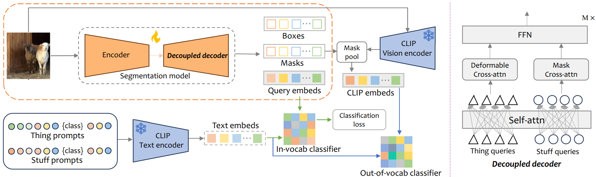
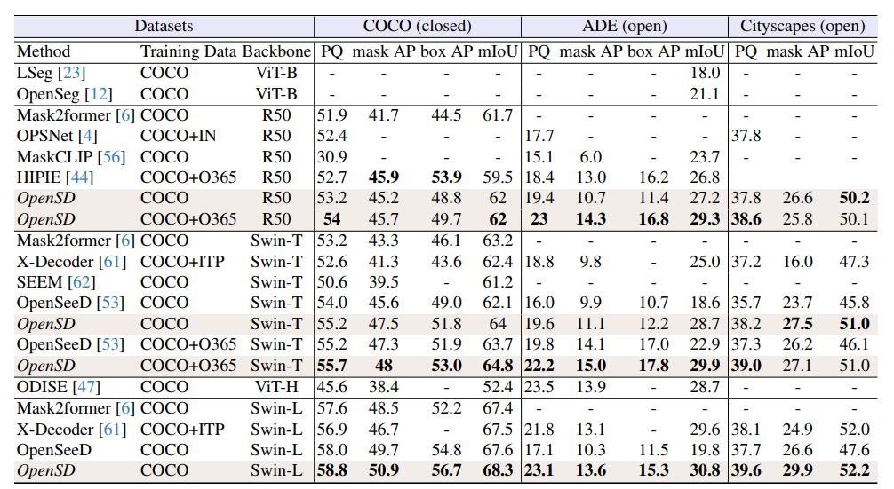
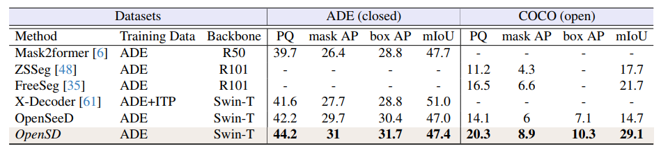

      
## OpenSD: Unified Open-Vocabulary Segmentation and Detection


Codes and pretained models will be released soon. 

<a href="https://arxiv.org/abs/2312.06703"></a> 

[Shuai Li](https://scholar.google.com.hk/citations?hl=zh-CN&user=Bd73ldQAAAAJ)<sup>1,2</sup> | [Minghan Li](https://scholar.google.com/citations?user=LhdBgMAAAAAJ&hl=en)<sup>1,2</sup> | [Pengfeng Wang](https://scholar.google.com/citations?user=zAAYwRYAAAAJ&hl=en)<sup>1</sup> | [Lei Zhang](https://www4.comp.polyu.edu.hk/~cslzhang/)<sup>1,2</sup>

<sup>1</sup>The Hong Kong Polytechnic University, <sup>2</sup>OPPO Research Institute


### Update
- **2023.12.17**: Repo is released.


## Overview framework:



### Results

#### From COCO to ADE




#### From ADE to COCO



### Contact
If you have any questions, please contact: novak.li@connect.polyu.hk

### License
This project is released under the [Apache 2.0 license](LICENSE).

### Citations
If our code helps your research or work, please consider citing our paper.
The following are BibTeX references:

```
@article{li2023opensd,
      title={OpenSD: Unified Open-Vocabulary Segmentation and Detection}, 
      author={Shuai Li and Minghan Li and Pengfei Wang and Lei Zhang},
      journal={arXiv preprint arXiv:2312.06703},
      year={2023}
}
```


<details>
<summary>statistics</summary>


</details>